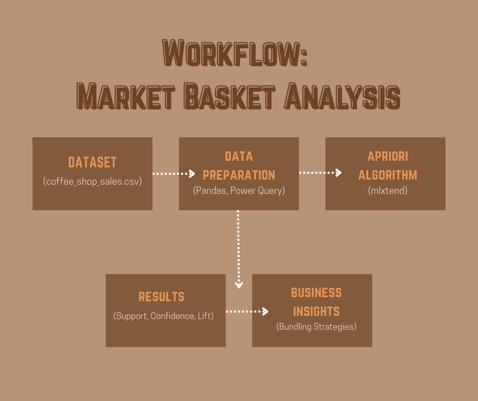

# Coffee Shop Market Basket Analysis

## 📌 Project Overview
This project extends the Daily Grind Coffee Shop dataset by applying **Market Basket Analysis** using the Apriori algorithm.  

The goal is to uncover frequent product combinations and generate actionable insights for **product bundling** and **promotion strategies**.

## 🚀 Executive Summary

This project applies **Market Basket Analysis** to the *Daily Grind Coffee Shop* dataset to uncover product pairings and bundling opportunities. Since the original dataset only contained one item per transaction, I simulated realistic multi-item baskets to make the analysis possible using Python.

Beyond the technical need, simulation also allowed me to build on my larger Daily Grind Coffee Dashboard Project. The dashboard focused on sales, customer insights, and operations at the transactional level, while this project demonstrates how the same dataset can be re-engineered into basket-level data for advanced data science techniques.

The results show that bakery items like **Croissants** and **Blueberry Muffins** frequently co-occur with drinks such as **Lattes** and **Cappuccinos**, though associations were modest (lift ≈ 1.0). Even so, this project demonstrates my ability to adapt data for scalability, apply machine learning algorithms, and translate findings into actionable strategies like bundling and upselling — while connecting BI dashboards with deeper statistical modeling.

## ⚙️ Tools & Libraries
- Python (pandas, numpy)
- mlxtend (Apriori & Association Rules)
- matplotlib / seaborn (visualization)
- Jupyter Notebook

## 📊 Workflow

1. **Data Preparation**  
   - Re-engineered dataset into multi-item baskets.  
   - One-hot encoded transactions for Apriori algorithm.  

2. **Frequent Itemset Mining**  
   - Identified popular single items (e.g., Croissants, Muffins).  
   - Discovered item pairs (e.g., Muffin + Cappuccino).  

3. **Association Rules**  
   - Analyzed confidence, lift, and support for product combinations.  
   - Found modest but useful associations (e.g., Latte → Croissant).  

4. **Business Insights**  
   - Suggested bundling opportunities (Latte + Croissant).  
   - Recommended testing promotions to increase average order size.  

##🔹Results, Limitations, and Reflection
## 📊 Results

The Market Basket Analysis revealed several frequent itemsets. For example, Croissants (50%) and Blueberry Muffins (49%) appeared in nearly half of all simulated transactions, while drinks like Cappuccinos, Lattes, and Chai Lattes occurred in around 18–20%. Pairs such as Muffin + Cappuccino or Latte + Croissant appeared in about 9–10% of transactions.

The association rules indicated that these pairs had confidence values near 50%, meaning that when one item was purchased, there was roughly a 50% chance the paired item was also bought. However, the lift values (~1.0) suggested that these patterns were only slightly better than random chance.

## ⚠️ Data Simulation Notice
The original coffee_shop_sales.csv dataset contained one item per transaction, which made it unsuitable for a Market Basket Analysis (since association rule mining requires multi-item baskets).
To address this, I simulated realistic multi-item orders by randomly grouping products together. This step was necessary to demonstrate the Apriori algorithm and uncover product associations.
While the associations discovered are modest due to the simulated nature of the data, the process highlights my ability to: 
- Identify and adapt to dataset limitations.
- Engineer a structure suitable for advanced analytics.
- Translate algorithm outputs into business-relevant insights.

In a production setting, the same methodology would be applied to true basket-level POS data, yielding stronger and more actionable rules.

Another reason for simulating multi-item transactions was to extend my larger Daily Grind Coffee Shop Analytics project. The original dashboard project focused on sales trends, customer loyalty, and operational insights using the raw transactional file. By engineering basket-level data, I was able to build on that foundation and demonstrate how the same dataset can power more advanced analytics techniques like Market Basket Analysis. This showed how a single dataset can evolve into a broader business intelligence and data science portfolio.

## 🤔 Reflection
This project highlighted both the challenges and opportunities of working with transactional retail data. Because the original dataset only contained one item per transaction, I engineered simulated multi-item baskets to enable Market Basket Analysis. This decision was not just technical — it was also strategic. By re-engineering the data, I was able to extend my larger Brew-Haha Dashboard Project into a data science application, demonstrating how a single dataset can evolve into multiple forms of analysis.

While the simulated baskets yielded relatively weak rules (lift ≈ 1.0), the process underscored the importance of data preparation, feature engineering, and understanding limitations. More importantly, it showed how the combination of BI dashboards and advanced modeling techniques creates a richer analytics ecosystem: dashboards deliver descriptive insights for business stakeholders, while basket analysis introduces predictive and prescriptive layers for marketing and sales strategy.

From a practical standpoint, even modest patterns — such as frequent pairings of croissants with lattes or muffins with cappuccinos — can inspire bundling promotions, upsell strategies, and loyalty incentives. In a real-world environment, applying the same methodology to basket-level POS data would yield stronger associations, creating high-impact opportunities for product placement and campaign design.

## 🟢 Author
Ardonna Cardines — Data & Decision Analyst

## 🔗 Related Project
This analysis builds on my **Daily Grind Coffee Dashboard Project**, where I designed a Power BI reporting solution for sales, products, and customer insights.  
👉 [Daily Grind Coffee Dashboard Project](https://github.com/aleighcar/coffee-shop-sales-bi-dashboard)
